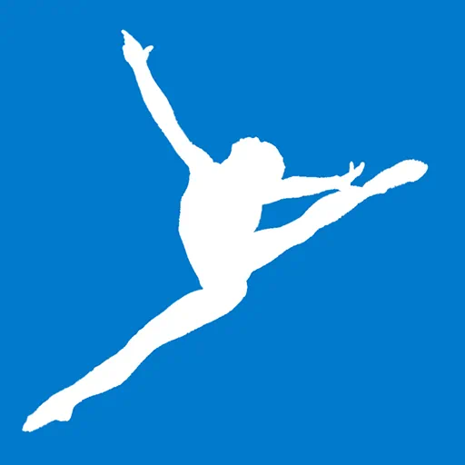

  
  <h1>Type Gymnastics</h1>
  
Collection of wonderful TypeScript type gymnastics code snippets.

## 📚 Overview List

- [Better `querySelector`](https://github.com/g-plane/type-gymnastics/tree/master/src/better-querySelector) by [Pig Fang](https://github.com/g-plane) - More intelligent `querySelector` by parsing your given CSS selector.
- [C-printf Parser](https://github.com/g-plane/type-gymnastics/tree/master/src/c-printf-parser) by [Pig Fang](https://github.com/g-plane) - Parse placeholders like `%d` and `%s` for a `printf` format string.
- [Query String Parser](https://github.com/g-plane/type-gymnastics/tree/master/src/query-string-parser) by [Pig Fang](https://github.com/g-plane) - Parse URL query string into an object literal type.
- [Spec-compliant HTML Parser](https://github.com/g-plane/type-gymnastics/tree/master/src/spec-compliant-html-parser) by [Pig Fang](https://github.com/g-plane) - An HTML parser conforms [WHATWG HTML Standard](https://html.spec.whatwg.org/multipage/syntax.html#syntax) (may not be fully).
- [Tuple Slice] by [Pig Fang](https://github.com/g-plane) - `Array#slice` implementation at type level.
- [URL Parser](https://github.com/g-plane/type-gymnastics/tree/master/src/url-parser) by [Pig Fang](https://github.com/g-plane) - Parse a URL into an object literal type with each component of the URL.

## 🔍 View Source Code

All the source code are under `src` directory.

It's recommended to view them at local with these steps:

1. Make sure you've installed Git, Node.js and Visual Studio Code.
2. Clone this repository with Git.
3. Run `npm i` or `yarn` to install TypeScript.
4. Open this repository in Visual Studio Code.
5. Enjoy it!

## 📝 Contributing

Create a new empty directory under `src` directory
and give it a descriptive and short name,
then put your source code in it.
Also, please consider adding some tests.

Optionally, you can put a readme in that directory to introduce
your code in detail.

Last, please update the "Overview List" section of this readme
to add a new item for your code with brief.

We assume your code published under MIT License.

## 🍻 Related

- [Type Challenges](https://github.com/type-challenges/type-challenges)

## 📜 License

MIT License

Logo is modified from Picture [Day 5 Gymnastics (19 Aug 2010)](https://www.flickr.com/photos/15322733@N05/4907865188). "Day 5 Gymnastics (19 Aug 2010)" by Singapore 2010 Youth Olympic Games is licensed with CC BY-NC 2.0.
